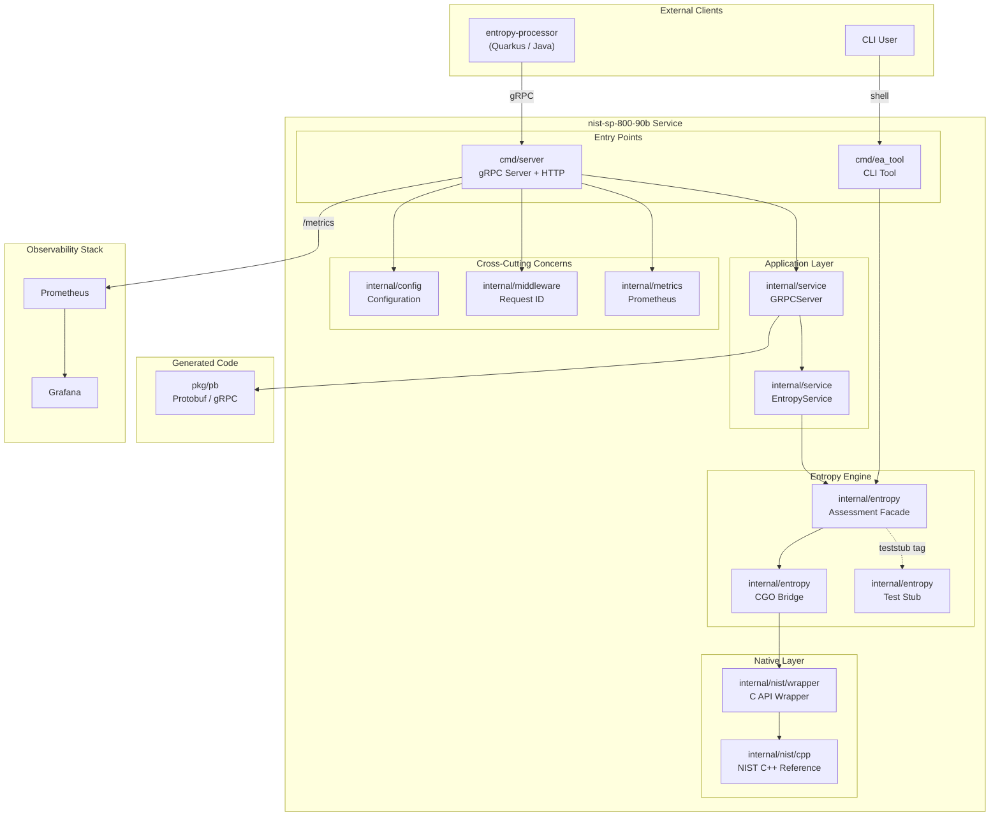
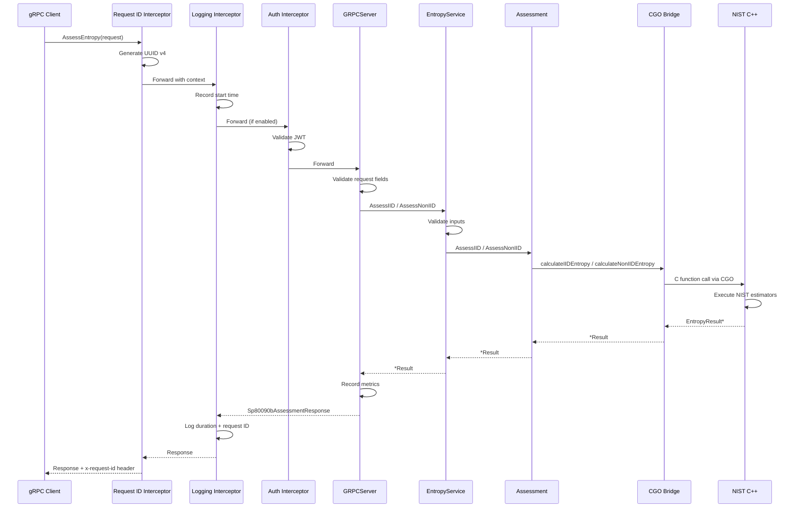
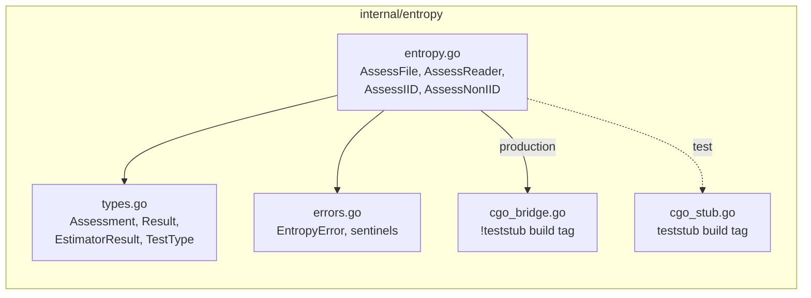
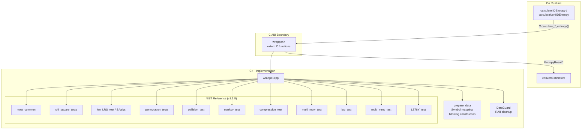
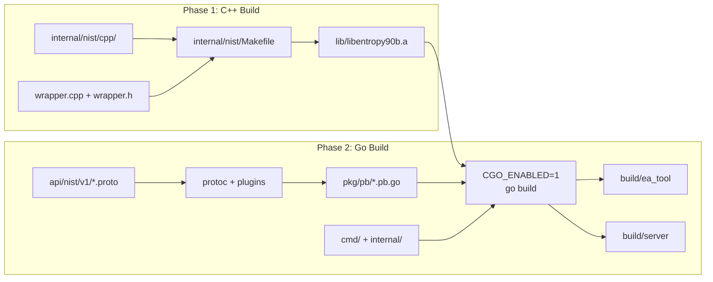
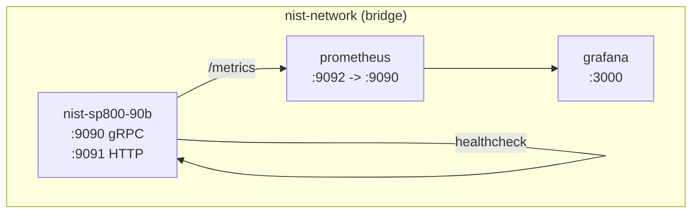

# NIST SP 800-90B Service Architecture

## 1. Overview

The NIST SP 800-90B service is a Go microservice that provides entropy assessment capabilities in accordance with NIST Special Publication 800-90B, "Recommendation for the Entropy Sources Used for Random Bit Generation." The service wraps the official NIST C++ reference implementation (SP800-90B_EntropyAssessment, version 1.1.8) through a CGO bridge, exposing its functionality via both a command-line interface and a gRPC API with Prometheus-based observability.

Within the broader decay-entropy-stream system, this service functions as a dedicated assessment endpoint. The `entropy-processor` Quarkus microservice invokes this service over gRPC to evaluate the min-entropy of entropy source samples collected from hardware noise sources. The proto contract shared between the two services ensures interoperability across the Go and Java language boundaries.

The service implements two assessment modes defined by NIST SP 800-90B:

- **IID (Independent and Identically Distributed)**: Statistical tests including Most Common Value estimation, chi-square independence tests, longest repeated substring analysis, and permutation testing.
- **Non-IID**: Ten conservative entropy estimators defined in Section 6.3 of the standard, including Most Common Value, Collision, Markov, Compression, t-Tuple, LRS, MultiMCW, Lag Prediction, MultiMMC, and LZ78Y tests.

## 2. High-Level Architecture

The following diagram illustrates the primary components and their relationships within the service.



## 3. Project Structure

The service follows the standard Go project layout with `cmd/` for entry points, `internal/` for private packages, `pkg/` for generated code, and `api/` for protocol definitions.

```
nist-sp-800-90b/
|-- api/nist/v1/                 # Protobuf service definitions
|   +-- nist_sp800_90b.proto
|-- cmd/
|   |-- ea_tool/                 # CLI entry point
|   |   |-- main.go
|   |   +-- runner.go
|   +-- server/                  # gRPC + HTTP server entry point
|       +-- main.go
|-- internal/
|   |-- config/                  # Environment-based configuration
|   |   |-- config.go
|   |   +-- config_test.go
|   |-- entropy/                 # Core entropy assessment logic
|   |   |-- types.go             # Domain types (Assessment, Result, EstimatorResult)
|   |   |-- entropy.go           # Assessment facade (IID/Non-IID dispatch)
|   |   |-- cgo_bridge.go        # CGO bindings (excluded with teststub)
|   |   |-- cgo_stub.go          # Deterministic stubs (teststub only)
|   |   |-- errors.go            # Structured error types
|   |   +-- entropy_test.go
|   |-- metrics/                 # Prometheus instrumentation
|   |   |-- prometheus.go
|   |   +-- prometheus_test.go
|   |-- middleware/               # gRPC interceptors
|   |   |-- request_id.go
|   |   +-- request_id_test.go
|   |-- nist/                    # Native C++ library
|   |   |-- cpp/                 # Bundled NIST reference (v1.1.8)
|   |   |   |-- iid/             # IID test implementations
|   |   |   |-- non_iid/         # Non-IID estimator implementations
|   |   |   +-- shared/          # Common utilities and data structures
|   |   |-- wrapper/             # C-linkage API for CGO consumption
|   |   |   |-- wrapper.h
|   |   |   +-- wrapper.cpp
|   |   |-- lib/                 # Compiled static library output
|   |   +-- Makefile             # C++ build rules
|   +-- service/                 # Business logic + gRPC transport
|       |-- service.go
|       |-- grpc_server.go
|       +-- grpc_server_test.go
|-- pkg/pb/                      # Generated protobuf/gRPC code
|-- tools/                       # Validation and CI utilities
|   +-- run_90b_validation.sh
|-- deployments/                 # Prometheus and Grafana configurations
|-- .github/workflows/           # CI and validation pipelines
|-- Dockerfile                   # Multi-stage container build
|-- docker-compose.yml           # Full observability stack
|-- Makefile                     # Top-level build orchestration
+-- go.mod                       # Go 1.25.5 module definition
```

## 4. Component Architecture

### 4.1 Entry Points

The service provides two independent entry points that share the same entropy assessment engine.

**gRPC Server (`cmd/server/main.go`)**: The primary production entry point. It bootstraps the configuration subsystem, initializes gRPC and HTTP listeners, registers the `Sp80090bAssessmentService` and health check services, and blocks until a termination signal triggers graceful shutdown with a 30-second deadline. The HTTP listener serves Prometheus metrics at `/metrics` and a health endpoint at `/health`.

**CLI Tool (`cmd/ea_tool/main.go`, `runner.go`)**: A batch-processing command-line tool that reads binary data from a file or standard input and performs a single IID or Non-IID assessment. Output is rendered as human-readable text or serialized to JSON. The tool directly instantiates the `Assessment` facade without requiring network infrastructure.

### 4.2 Service Layer

The service layer implements a two-tier separation between transport concerns and business logic.



**GRPCServer** (`internal/service/grpc_server.go`): Implements the `Sp80090bAssessmentServiceServer` interface generated from the protobuf definition. It validates incoming request parameters (non-empty data, valid bits-per-symbol range, at least one mode selected), delegates to `EntropyService`, converts internal result types to protobuf messages, and records Prometheus metrics for each assessment. When both IID and Non-IID modes are requested simultaneously, the overall min-entropy is computed as the minimum across both results.

**EntropyService** (`internal/service/service.go`): Encapsulates the business logic layer. It performs input validation and delegates to the `Assessment` facade. This separation allows the assessment logic to be reused by both the gRPC server and the CLI tool without transport-layer coupling.

### 4.3 Entropy Engine

The entropy engine is the computational core of the service, implemented across four files in the `internal/entropy/` package.



**Assessment** (`types.go`): The primary facade type. It holds a verbosity level (0-3) and provides the `AssessIID` and `AssessNonIID` methods that validate inputs and delegate to the CGO bridge or test stub.

**Result** (`types.go`): The aggregate output structure containing:
- `HOriginal`: Per-sample entropy estimated from the original symbol alphabet
- `HBitstring`: Per-sample entropy estimated from the binary expansion of symbols
- `HAssessed`: The conservative minimum of `HOriginal` and `HBitstring * word_size`
- `MinEntropy`: Equal to `HAssessed`, representing the final assessed min-entropy
- `Estimators`: Individual results from each statistical test or entropy estimator

**Build Tag Strategy**: The package uses Go build tags to decouple unit testing from the C++ toolchain. The `cgo_bridge.go` file (compiled without the `teststub` tag) contains the actual CGO bindings, while `cgo_stub.go` (compiled only with `-tags=teststub`) provides deterministic mock implementations. This design enables CI to enforce a 90% coverage threshold without requiring the full C++ build environment for every test run.

### 4.4 CGO Bridge and C++ Wrapper

The CGO bridge constitutes the most architecturally significant component, as it manages the boundary between Go's memory model and the C++ reference implementation.



**Memory Management**: The C wrapper follows a caller-owns-result pattern. Each `calculate_*_entropy` function allocates an `EntropyResult` structure on the heap using `malloc`. The Go caller is responsible for invoking `free_entropy_result` via `defer` after extracting the results. Internally, a `DataGuard` RAII class ensures that the NIST `data_t` structure is properly cleaned up even if the C++ reference code throws an exception.

**Data Preparation** (`prepare_data`): This function initializes the NIST `data_t` structure from raw byte input. It performs:
1. Word-size auto-detection when `bits_per_symbol` is zero, by scanning the bitmask of all input bytes
2. Symbol alphabet construction and mapping to a contiguous range
3. Bitstring representation generation for estimators that operate on binary sequences

**Error Handling**: C++ exceptions are caught at the wrapper boundary and translated into error codes stored in the `EntropyResult` structure. The Go bridge inspects `error_code` and converts non-zero values into structured `EntropyError` instances using sentinel errors (`ErrCFunction`, `ErrMemoryAllocation`, `ErrInvalidData`).

**Compiler and Linker Configuration**: The CGO directives in `cgo_bridge.go` specify:
- C++ compilation flags: `-std=c++11 -fopenmp`
- Include paths pointing to the bundled NIST C++ headers and the wrapper directory
- Linkage against the static library `libentropy90b.a` and system libraries: `bz2`, `divsufsort`, `divsufsort64`, `jsoncpp`, `mpfr`, `gmp`, `gomp`, `stdc++`, `crypto`

### 4.5 Configuration

The `internal/config` package provides environment-variable-based configuration with validation at load time. All settings have sensible defaults, and the configuration is validated for cross-field constraints (for example, TLS and authentication both require gRPC to be enabled).

| Variable | Default | Description |
|---|---|---|
| `METRICS_PORT` / `SERVER_PORT` | `9091` | HTTP bind port for health and metrics |
| `SERVER_HOST` | `0.0.0.0` | Network interface to bind |
| `GRPC_ENABLED` | `false` | Enable the gRPC listener |
| `GRPC_PORT` | `9090` | gRPC listener port |
| `TLS_ENABLED` | `false` | Enable TLS for gRPC |
| `TLS_CERT_FILE` | (empty) | Server certificate path |
| `TLS_KEY_FILE` | (empty) | Server private key path |
| `TLS_CA_FILE` | (empty) | CA bundle for client verification |
| `TLS_CLIENT_AUTH` | `none` | Client auth mode (none, request, requireany, verifyifgiven, requireandverify, mtls) |
| `TLS_MIN_VERSION` | `1.2` | Minimum TLS protocol version |
| `AUTH_ENABLED` | `false` | Enable OAuth2/OIDC token validation |
| `AUTH_ISSUER` | (empty) | Expected token issuer |
| `AUTH_AUDIENCE` | (empty) | Expected token audience |
| `AUTH_TOKEN_TYPE` | `jwt` | Token mode (`jwt` or `opaque`) |
| `AUTH_JWKS_URL` | (empty) | Custom JWKS endpoint (JWT mode) |
| `AUTH_INTROSPECTION_URL` | (empty) | OAuth2 introspection endpoint (opaque mode) |
| `AUTH_INTROSPECTION_AUTH_METHOD` | `client_secret_basic` | Introspection client auth method (`client_secret_basic` or `private_key_jwt`) |
| `AUTH_INTROSPECTION_CLIENT_ID` | (empty) | Introspection client ID (`client_secret_basic`; optional for Zitadel key JSON with `private_key_jwt`) |
| `AUTH_INTROSPECTION_CLIENT_SECRET` | (empty) | Introspection client secret (`client_secret_basic`) |
| `AUTH_INTROSPECTION_PRIVATE_KEY` | (empty) | Introspection private key content for `private_key_jwt` (PEM, JWK JSON, or Zitadel key JSON) |
| `AUTH_INTROSPECTION_PRIVATE_KEY_FILE` | (empty) | File path alternative for `AUTH_INTROSPECTION_PRIVATE_KEY` |
| `AUTH_INTROSPECTION_PRIVATE_KEY_JWT_KID` | (empty) | Optional `kid` override for `private_key_jwt` assertions |
| `AUTH_INTROSPECTION_PRIVATE_KEY_JWT_ALG` | (empty) | Optional assertion signing algorithm (`RS256` or `ES256`) |
| `MAX_UPLOAD_SIZE` | `104857600` | Maximum upload size in bytes (100 MB) |
| `TIMEOUT` | `5m` | HTTP read/write timeout |
| `LOG_LEVEL` | `info` | Log verbosity (debug, info, warn, error) |
| `METRICS_ENABLED` | `true` | Enable Prometheus metrics endpoint |

### 4.6 Observability

#### 4.6.1 Prometheus Metrics

Five metric families are registered via `promauto` in the `internal/metrics` package:

| Metric | Type | Labels | Description |
|---|---|---|---|
| `entropy_requests_total` | Counter | `test_type` | Total assessment requests |
| `entropy_duration_seconds` | Histogram | `test_type` | Assessment duration (exponential buckets: 10 ms to ~10 s) |
| `entropy_errors_total` | Counter | `test_type`, `error_type` | Error counts by classification |
| `entropy_data_size_bytes` | Histogram | `test_type` | Payload sizes (exponential buckets: 1 KB to ~1 MB) |
| `entropy_min_entropy_value` | Histogram | `test_type` | Distribution of min-entropy values (linear buckets: 0 to 8, step 0.5) |

#### 4.6.2 Request Tracking

The `UnaryRequestIDInterceptor` in `internal/middleware` generates a UUID v4 for each gRPC request, injects it into the Go context, and returns it to the client via the `x-request-id` response metadata header. The logging interceptor in `cmd/server` captures this ID alongside the gRPC method name and request duration for structured JSON log output via zerolog.

#### 4.6.3 Health Endpoint

The HTTP server exposes a `/health` endpoint that returns JSON with the service status and version string. The Docker Compose health check polls this endpoint every 30 seconds.

### 4.7 Security

The service supports three security mechanisms, all of which are optional and independently configurable:

**TLS**: When `TLS_ENABLED=true`, the gRPC server loads the specified certificate and key files and configures the minimum TLS protocol version. The `go-authx/grpcserver` library handles the TLS credential setup.

**mTLS (Mutual TLS)**: Controlled by `TLS_CLIENT_AUTH`, the server can require clients to present and verify X.509 certificates against a trusted CA bundle specified in `TLS_CA_FILE`.

**OIDC Authentication**: When `AUTH_ENABLED=true`, a token validation interceptor is appended to the gRPC interceptor chain. In `AUTH_TOKEN_TYPE=jwt` mode, `go-authx` validates JWT access tokens via JWKS auto-discovery or `AUTH_JWKS_URL`. In `AUTH_TOKEN_TYPE=opaque` mode, `go-authx` validates opaque access tokens via RFC 7662 introspection (`AUTH_INTROSPECTION_URL`). Introspection client authentication supports both `client_secret_basic` and RFC 7523 `private_key_jwt` (PEM/JWK/Zitadel key JSON). Health check endpoints (`/grpc.health.v1.Health/Check` and `/grpc.health.v1.Health/Watch`) are exempted from authentication.

## 5. Build Architecture

The build process involves two distinct compilation phases coordinated by the top-level Makefile.



**Phase 1 -- C++ Compilation**: The inner Makefile at `internal/nist/Makefile` compiles `wrapper.cpp` against the bundled NIST C++ headers using `g++` with C++11 and OpenMP flags, then archives the resulting object into a static library `libentropy90b.a`. This library is linked at CGO build time.

**Phase 2 -- Go Compilation**: The top-level Makefile first generates protobuf code from `api/nist/v1/nist_sp800_90b.proto` using `protoc` with the `protoc-gen-go` and `protoc-gen-go-grpc` plugins. It then invokes `go build` with `CGO_ENABLED=1` to produce the `ea_tool` CLI binary and the `server` binary. The CGO directives in `cgo_bridge.go` reference the static library from Phase 1.

**Docker Build**: The multi-stage Dockerfile uses `golang:1.25-bookworm` as the builder image with all C++ development dependencies installed. The runtime image is `debian:bookworm-slim` with only the shared library runtime packages. The final image runs as a non-root user (`entropy:1000`) and exposes ports 9090 (gRPC) and 9091 (HTTP metrics/health).

## 6. Deployment Architecture

The Docker Compose configuration defines a three-container stack for local development and demonstration.



| Container | Image | Ports | Purpose |
|---|---|---|---|
| `nist-sp800-90b` | `ghcr.io/ammannchristian/nist-sp800-90b:latest` | 9090, 9091 | Assessment service |
| `nist-prometheus` | `prom/prometheus:latest` | 9092 | Metrics collection (30-day retention) |
| `nist-grafana` | `grafana/grafana:latest` | 3000 | Dashboard visualization |

## 7. Integration with entropy-processor

The `entropy-processor` Quarkus service consumes this service over gRPC using a mirror of the same proto definition. The proto files share identical message structures and field numbers:

| Proto Location | Language Options | Package |
|---|---|---|
| `external/nist-sp-800-90b/api/nist/v1/nist_sp800_90b.proto` | `go_package` | `nist.sp800_90b.v1` |
| `entropy-processor/src/main/proto/nist_sp800_90b.proto` | `java_package`, `java_multiple_files`, `java_outer_classname` | `nist.sp800_90b.v1` |

Both definitions declare the same `Sp80090bAssessmentService` with a single `AssessEntropy` RPC, ensuring wire-level compatibility. The Java-side proto includes Java-specific generation options (`java_package = "com.ammann.entropyanalytics.grpc.proto.sp80090b"`), while the Go-side proto specifies the Go package path.

## 8. Testing Strategy

### 8.1 Build Tag Isolation

The service uses the `teststub` build tag to enable unit testing without the C++ toolchain. When `-tags=teststub` is passed to the Go test runner, the deterministic stub implementations in `cgo_stub.go` replace the CGO bridge. The stubs return fixed entropy values and support sentinel-based error injection:

- First byte `0xFF`: Triggers an `ErrInvalidData` error for testing error paths
- First byte `0xEE`: Returns infinity values for testing edge-case handling in the gRPC server

### 8.2 Coverage

CI enforces a 90% coverage threshold across `internal/...` and `cmd/ea_tool` packages. Coverage is generated in atomic mode with shuffling disabled for deterministic profiles. The current coverage snapshot, as documented in the repository, reports per-package figures ranging from 78.9% (`cmd/ea_tool`) to 100% (`internal/config`, `internal/metrics`).

### 8.3 Scientific Validation

The `nist-validation.yml` workflow (triggered manually) clones the upstream NIST reference implementation, builds its C++ binaries (`ea_iid_ref`, `ea_non_iid_ref`), and runs both the reference tools and the Go service against bundled sample datasets. The validation script (`tools/run_90b_validation.sh`) compares min-entropy values with floating-point tolerance (`1e-12` absolute, `1e-12` relative) and produces a tabular summary.

## 9. Continuous Integration

The CI pipeline (`ci.yml`) executes on every push and pull request to the `main` branch.

| Stage | Actions |
|---|---|
| Build and Test | Protobuf generation, C++ library build, format check, `go vet`, staticcheck, gosec, govulncheck, unit tests with JUnit reporting, coverage with threshold enforcement, native binary build |
| Race Tests | Runs the test suite with Go's race detector (`-race` flag) |
| Docker Publish | Builds and pushes the container image to GHCR (main branch only) |

The Docker image is published to `ghcr.io/<owner>/nist-sp800-90b` with both a `latest` tag and a SHA-based tag for immutable references.

## 10. Design Decisions and Rationale

### 10.1 CGO over Pure Go

The decision to use CGO rather than a pure Go reimplementation ensures bit-exact compatibility with the NIST reference implementation. The C++ reference code contains complex numerical algorithms (suffix array construction, Markov chain analysis, compression-based estimation) whose correctness is established by the NIST validation process. Reimplementing these algorithms in Go would introduce a risk of numerical divergence and would require a separate validation effort.

### 10.2 Static Library Linking

The C++ code is compiled into a static library (`libentropy90b.a`) rather than a shared library. This simplifies deployment by eliminating runtime library path dependencies and ensures that the Docker image contains a self-contained binary with all native code embedded.

### 10.3 Build Tag Test Strategy

The `teststub` build tag pattern allows the service to maintain high test coverage without coupling the CI environment to the C++ toolchain for every test run. This is particularly important because the NIST reference implementation requires at least 1,000,000 samples for reliable entropy estimation, making full-stack integration tests impractical for routine CI execution.

### 10.4 Optional gRPC

The gRPC listener is disabled by default (`GRPC_ENABLED=false`), allowing the service to run in CLI-only mode for batch processing scenarios. This design accommodates both interactive service deployment and offline batch analysis workflows without requiring separate binaries.

### 10.5 RAII Memory Safety

The `DataGuard` class in `wrapper.cpp` implements RAII (Resource Acquisition Is Initialization) to ensure that the NIST `data_t` structure is always freed, even when C++ exceptions propagate through the estimator code. This prevents memory leaks at the CGO boundary, where Go's garbage collector has no visibility into C-allocated memory.

## 11. Technology Summary

| Aspect | Technology |
|---|---|
| Language | Go 1.25.5 with CGO |
| Native Code | C++11 with OpenMP |
| RPC Framework | gRPC (google.golang.org/grpc v1.78.0) |
| Protocol Definitions | Protocol Buffers v3 |
| Authentication | OIDC JWT + opaque token introspection (client_secret_basic/private_key_jwt) via go-authx v1.1.0 |
| Logging | zerolog (structured JSON) |
| Metrics | Prometheus client_golang v1.23.2 with promauto |
| Testing | testify, gotestsum, teststub build tag |
| Static Analysis | staticcheck, gosec, govulncheck, gofumpt |
| Container | Multi-stage Dockerfile (bookworm builder, bookworm-slim runtime) |
| CI/CD | GitHub Actions |
| License | MIT |
